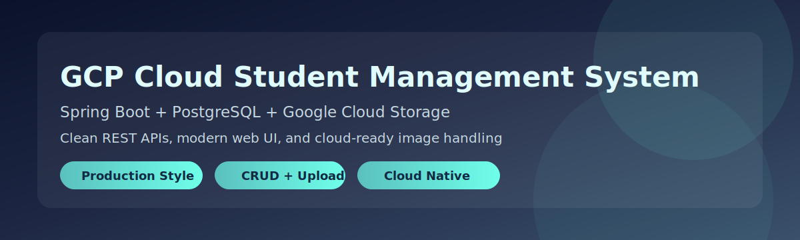
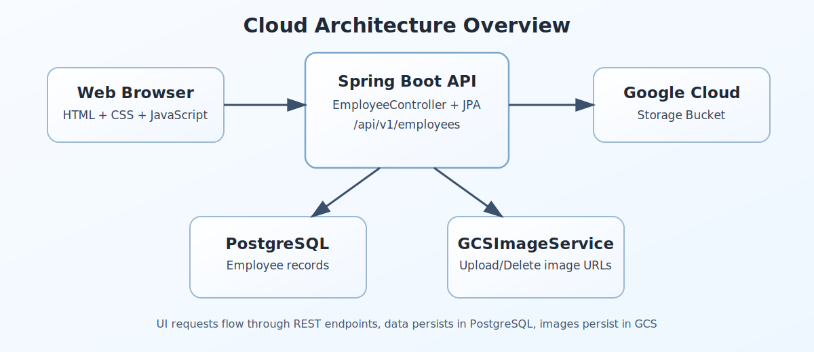

<div align="center">



# GCP Cloud Student Management System

[](https://openjdk.org/)
[](https://spring.io/projects/spring-boot)
[](https://www.postgresql.org/)
[](https://cloud.google.com/storage)

A professional full-stack student management platform with cloud-ready architecture, clean REST APIs, and modern UX.

</div>

---

## Table of Contents

- [Project Vision](#project-vision)
- [What Makes It Strong](#what-makes-it-strong)
- [Visual Architecture](#visual-architecture)
- [Tech Stack](#tech-stack)
- [Project Structure](#project-structure)
- [Quick Start](#quick-start)
- [Configuration Profiles](#configuration-profiles)
- [API Reference](#api-reference)
- [Troubleshooting 400 Errors](#troubleshooting-400-errors)
- [Image Gallery](#image-gallery)
- [Security Essentials](#security-essentials)
- [Build and Test](#build-and-test)

---

## Project Vision

This project demonstrates how to build a real-world student information system that combines:

- Reliable relational data management with PostgreSQL
- High-quality REST API design with Spring Boot
- Cloud-based image handling through Google Cloud Storage
- A polished browser UI using HTML, CSS, and JavaScript

It is ideal for learning, portfolio presentation, and cloud application practice.

## What Makes It Strong

- Clean CRUD workflow with validation and duplicate contact protection
- Profile-based configuration for local and cloud environments
- Multipart form-data handling for image upload
- Searchable student list with responsive UI interactions
- Graceful behavior even when optional cloud image service is unavailable

## Visual Architecture



**Request flow:** Browser UI -> `EmployeeController` -> `EmployeeRepository` and `GcsImageService`.

## Tech Stack

| Layer | Technology |
|---|---|
| Backend | Java 17, Spring Boot 4.0.2, Spring Data JPA, Hibernate |
| Database | PostgreSQL |
| Cloud Storage | Google Cloud Storage (`google-cloud-storage`) |
| Frontend | HTML5, CSS3, Vanilla JavaScript |
| Build Tool | Maven Wrapper (`mvnw`, `mvnw.cmd`) |

## Project Structure

```text
src/main/java/lk/ijse/eca/cloud_rdbms/
  config/GcsConfig.java
  controller/EmployeeController.java
  entity/Employee.java
  repository/EmployeeRepository.java
  service/GcsImageService.java

src/main/resources/
  application.yaml
  application-dev.yaml
  application-gcp.yaml
  static/index.html
  static/app.js

docs/images/
  hero-banner.svg
  architecture.svg
```

## Quick Start

### Prerequisites

- JDK 17+
- PostgreSQL running locally or in cloud
- Optional: GCP service account credentials for image upload

### Run on Windows PowerShell

```powershell
Set-Location "C:\Users\user\IdeaProjects\GCP-Cloud-Student-Management-System-with-Relational-Databases"
.\mvnw.cmd clean spring-boot:run
```

Open these URLs:

- UI: `http://localhost:8080/index.html`
- API: `http://localhost:8080/api/v1/employees`

## Configuration Profiles

Default active profile in `src/main/resources/application.yaml`:

```yaml
spring:
  profiles:
    active: dev
```

### `dev` profile

Configure local DB in `src/main/resources/application-dev.yaml`:

```yaml
spring:
  datasource:
    url: jdbc:postgresql://localhost:5432/postgres
    username: postgres
    password: your_password
```

### `gcp` profile

Set DB details in `src/main/resources/application-gcp.yaml`, then run with:

```powershell
.\mvnw.cmd spring-boot:run "-Dspring-boot.run.profiles=gcp"
```

## API Reference

| Method | Endpoint | Description |
|---|---|---|
| `GET` | `/api/v1/employees` | Get all students |
| `GET` | `/api/v1/employees/{id}` | Get one student |
| `POST` | `/api/v1/employees` | Create student (form-data) |
| `PUT` | `/api/v1/employees/{id}` | Update student (form-data) |
| `DELETE` | `/api/v1/employees/{id}` | Delete student |

Required form fields for create and update:

- `name`
- `address`
- `contact`
- optional `image`

## Troubleshooting 400 Errors

If `:8080/api/v1/employees` returns `400`, verify:

1. Request type is `multipart/form-data` (not raw JSON).
2. `name`, `address`, and `contact` are not empty.
3. `contact` is unique.
4. Frontend uses this local URL in `src/main/resources/static/app.js`:
   - `http://localhost:8080/api/v1/employees`

Sample cURL request:

```bash
curl -X POST http://localhost:8080/api/v1/employees \
  -F "name=John Doe" \
  -F "address=Colombo" \
  -F "contact=0771234567" \
  -F "image=@C:/path/to/photo.jpg"
```

## Image Gallery

Use this section to showcase your real UI screenshots.

| Screen | Suggested File |
|---|---|
| Dashboard | `docs/images/dashboard.png` |
| Add Student Form | `docs/images/add-student.png` |
| Edit Student Modal | `docs/images/edit-student.png` |
| Delete Confirmation | `docs/images/delete-student.png` |

After adding screenshots, embed them like this:

```markdown

```

## Security Essentials

- Never commit service account JSON credentials.
- Prefer `GOOGLE_APPLICATION_CREDENTIALS` environment variable.
- Rotate and revoke keys if exposed.
- Keep bucket settings synchronized between `application.yaml` and `GcsImageService`.

## Build and Test

```powershell
.\mvnw.cmd clean test
.\mvnw.cmd clean package
```

---

## Next Upgrade Ideas

- Add Postman collection and API examples
- Add Docker Compose for one-command local setup
- Add CI pipeline (test, build, quality checks)
- Add authentication and role-based access control
